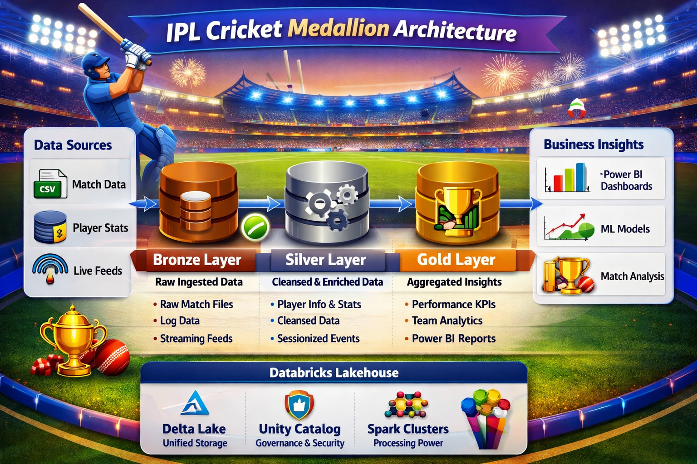

# 🏏 SmartCricket360 – IPL Data Engineering Framework

## SmartCricket360 – IPL Lakehouse Pipeline


[](https://www.linkedin.com/in/pawandubey1990/)

---

## 📐 Architecture Diagram


🏏📊⚡ Bronze → Silver → Gold pipeline powering IPL insights with Databricks Lakehouse  
🔴 Databricks LDP | 🔵 Delta Lake | 🟢 Unity Catalog | 🟠 Apache Spark | 🟡 Power BI


---
## Overview
### End‑to‑end IPL analytics pipeline built on Databricks Lakehouse using Medallion Architecture.
A production-grade data pipeline implementing the **Medallion Architecture** (Bronze → Silver → Gold) for comprehensive Indian Premier League (IPL) cricket analytics. This pipeline processes historical ball-by-ball delivery data and match metadata spanning multiple IPL seasons (2008-2026) to generate business-ready KPIs and insights.

### Architecture Approach

This implementation uses a **Hybrid Medallion Architecture** combining notebook flexibility with Lakeflow production features:

- **Bronze Layer (Raw Ingestion)**  
  Notebook-based ingestion of IPL CSV files into Delta format. Handles season normalization, schema conflicts, and metadata filtering.

- **Silver Layer (Cleansed & Enriched)**  
  Notebook transformations to derive metrics (runs, wickets, boundaries), handle nulls, and partition data by season for performance.

- **Gold Layer (Curated KPIs)**  
  Lakeflow Spark Declarative Pipeline orchestrates production-grade tables (batting, bowling, team, match, venue). Includes 12 automated data quality expectations.

- **Unity Catalog Views**  
  SQL-queryable views over Gold tables for easy integration with Databricks SQL, Power BI, and Tableau.

- **Governance & Reliability**  
  Delta Lake ensures ACID transactions, schema evolution, and time travel. Unity Catalog enforces governance, lineage, and security.

## 📊 Project Highlights

- ⚡ **295K+ ball‑by‑ball records** processed across 18 IPL seasons (2008–2026)  
- 🛡️ **12 automated data quality expectations** (null checks, range validations, business rules)  
- 🏆 **5 curated Gold tables**: batting, bowling, team performance, match summary, venue stats  
- 🔄 **Incremental updates & lineage tracking** with Lakeflow pipelines  
- 📊 **Dashboard‑ready datasets** exposed via Unity Catalog for Power BI & Tableau  
- 🔒 **Governance & reliability** with Delta Lake ACID transactions and Unity Catalog security  
- 👉 See the **Querying the Data** section below for sample SQL insights, including top batsmen, leading bowlers, and team rankings.

---

## 🔍 Querying the Data

### Using Unity Catalog Views

```sql
-- Top 10 batsmen by total runs in 2023 season
SELECT striker, season, total_runs, strike_rate, fours, sixes
FROM ipl_complete.ipl_complete_analytics.batting_stats_vw
WHERE season = '2023'
ORDER BY total_runs DESC
LIMIT 10;

-- Top 10 bowlers by wickets in 2023
SELECT bowler, season, wickets, economy_rate, bowling_average
FROM ipl_complete.ipl_complete_analytics.bowling_stats_vw
WHERE season = '2023'
ORDER BY wickets DESC
LIMIT 10;

-- Team performance rankings
SELECT team, season, wins, losses, total_runs, nrr
FROM ipl_complete.ipl_complete_analytics.team_performance_vw
WHERE season = '2023'
ORDER BY wins DESC;

-- Venue statistics
SELECT venue, matches_played, avg_score, avg_wickets
FROM ipl_complete.ipl_complete_analytics.venue_stats_vw
ORDER BY matches_played DESC;
```

### Using Direct Delta Paths

```python
# Read from Silver layer
silver_df = spark.read.format("delta") \
    .load("/Volumes/ipl_complete/ipl_complete_analytics/silver/deliveries")

# Filter for specific season
season_2023 = silver_df.filter("season = '2023'")
display(season_2023.limit(10))
```

---
## 🎯 Features

### Data Processing
* ✅ **295,732+ delivery records** processed across all IPL seasons
* ✅ **Season normalization** - Handles both numeric (2009) and slash formats (2007/08 → 2008)
* ✅ **Schema conflict resolution** - Automatic handling of schema inconsistencies
* ✅ **Metadata filtering** - Removes non-delivery rows from source files
* ✅ **Partition optimization** - Silver layer partitioned by season

### Data Quality
* ✅ **12 automated expectations** via Lakeflow pipeline
* ✅ **Null value handling** with coalesce patterns
* ✅ **Business rule validation** (wickets ≤ 10, runs ≥ 0, etc.)
* ✅ **Data type enforcement** across all layers

### Analytics Outputs
* ✅ **5 Gold tables** with standard IPL KPIs
* ✅ **Unity Catalog views** for easy querying
* ✅ **Event logs & lineage** tracking via Lakeflow
* ✅ **Incremental updates** support

---

## 📊 Output Tables

### Gold Layer Tables

#### 1. `batting_stats`
Player batting performance metrics aggregated by season
* Total runs, balls faced, strike rate
* Boundaries (fours, sixes)
* Batting average
* Centuries, fifties

#### 2. `bowling_stats`
Bowler performance metrics aggregated by season
* Wickets taken
* Economy rate
* Bowling average
* Runs conceded, balls bowled

#### 3. `team_performance`
Team-level statistics by season
* Wins, losses, total runs
* Net Run Rate (NRR)
* Home/away performance
* Tournament standings

#### 4. `match_summary`
Match-level aggregations
* Total runs per match
* Wickets per match
* Boundaries per match
* Match outcomes

#### 5. `venue_stats`
Venue-specific insights
* Matches played per venue
* Average scores by venue
* Winning patterns
* Home advantage metrics

---

## 🚀 Prerequisites

### Databricks Environment
* Databricks workspace with Unity Catalog enabled
* Serverless compute or interactive cluster
* Python and SQL language support

### Unity Catalog Resources
* **Catalog**: `ipl_complete`
* **Schema**: `ipl_complete_analytics`
* **Volumes**: `bronze`, `silver`, `gold`

### Data Source
* IPL dataset CSV files in Volume: `/Volumes/ipl_complete/ipl_complete_analytics/ipl_complete_dataset/ipl_complete_data_csv/`
  * Delivery files: `{match_id}.csv`
  * Match info files: `{match_id}_info.csv`

### Lakeflow Pipeline
* **Pipeline Name**: IPL Gold Layer Pipeline
* **Pipeline ID**: `8e58d57e-aed6-422e-b64f-7abe6c820963`
* **Type**: Lakeflow Spark Declarative Pipeline

---

## 📝 Setup Instructions

### 1. Initial Setup

```sql
-- Create Unity Catalog resources (if not exists)
CREATE CATALOG IF NOT EXISTS ipl_complete;
CREATE SCHEMA IF NOT EXISTS ipl_complete.ipl_complete_analytics;

-- Create volumes for each layer
CREATE VOLUME IF NOT EXISTS ipl_complete.ipl_complete_analytics.bronze;
CREATE VOLUME IF NOT EXISTS ipl_complete.ipl_complete_analytics.silver;
CREATE VOLUME IF NOT EXISTS ipl_complete.ipl_complete_analytics.gold;
```

### 2. Upload Source Data

Upload your IPL CSV files to:
```
/Volumes/ipl_complete/ipl_complete_analytics/ipl_complete_dataset/ipl_complete_data_csv/
```

Expected file structure:
* `335982.csv` (delivery file)
* `335982_info.csv` (match info file)
* ... (one pair per match)

### 3. Configure Lakeflow Pipeline

Ensure the Lakeflow Spark Declarative Pipeline is configured to:
* **Source**: Silver layer Delta tables
* **Target**: Gold layer managed tables in Unity Catalog
* **Expectations**: Data quality rules enabled
* **Mode**: Incremental processing

---

## 🎮 Usage

### One-Click Execution

The notebook supports **Run All** automation for end-to-end execution:

1. Open the notebook
2. Click **Run All**
3. Pipeline automatically executes:
   * Bronze layer ingestion (cells 6-8)
   * Silver layer transformation (cells 10-11)
   * Gold layer pipeline trigger (cell 13)
   * Unity Catalog view creation (cell 17)

### Manual Step-by-Step Execution

#### Step 1: Explore Data Structure (Cells 4-5)
```python
# Preview sample delivery and match info files
# Run cells 4 and 5 to understand the schema
```

#### Step 2: Bronze Layer - Raw Ingestion (Cells 7-9)
```python
# Creates Bronze volumes
# Loads all delivery files (295,732 records)
# Loads all match info files
# Filters metadata rows
# Normalizes season formats
```

#### Step 3: Silver Layer - Transform & Enrich (Cells 11-12)
```python
# Adds derived columns:
#   - total_runs = runs_off_bat + extras
#   - is_four, is_six, is_boundary
#   - is_wicket, legal_ball
# Handles null values with coalesce
# Partitions by season for performance
```

#### Step 4: Gold Layer - Lakeflow Pipeline (Cell 14)
```python
# Triggers Lakeflow Spark Declarative Pipeline
# Creates 5 managed tables with 12 expectations
# Polls for completion and reports status
```

#### Step 5: Create Unity Catalog Views (Cell 17)
```sql
-- Creates UC views over Gold Delta tables:
--   - batting_stats_vw
--   - bowling_stats_vw
--   - team_performance_vw
--   - match_summary_vw
--   - venue_stats_vw
```


## 🛡️ Data Quality Expectations

The Lakeflow pipeline enforces 12 automated expectations:

### Null Checks
1. `striker` is not null
2. `bowler` is not null
3. `team` is not null
4. `match_id` is not null
5. `venue` is not null

### Range Validations
6. `runs_off_bat` ≥ 0
7. `total_runs` ≥ 0
8. `strike_rate` ≥ 0
9. `economy_rate` ≥ 0

### Business Rules
10. `wickets` ≤ 10 (per match)
11. `season` matches valid year format (YYYY)
12. Date values are valid

---

## 📈 Performance Optimization

### Partitioning Strategy
* **Silver layer**: Partitioned by `season` for optimal query performance
* Enables partition pruning for season-specific queries
* Reduces I/O for time-based analysis

### Delta Lake Benefits
* ACID transactions ensure data consistency
* Time travel capability for auditing
* Optimized file layouts
* Schema evolution support

### Lakeflow Advantages
* Automatic dependency resolution
* Parallel processing of independent tables
* Incremental updates (only new data)
* Built-in retries and error handling

---

## 🔄 Incremental Updates

For subsequent runs with new data:

### Bronze Layer
```python
# Change mode from 'overwrite' to 'append'
deliveries_bronze.write.format("delta") \
    .mode("append") \
    .save(f"{bronze_path}/deliveries")
```

### Silver Layer
```python
# Use merge/upsert logic or append mode
deliveries_silver.write.format("delta") \
    .mode("append") \
    .partitionBy("season") \
    .save(f"{silver_path}/deliveries")
```

### Gold Layer
```python
# Trigger pipeline without full refresh
update = w.pipelines.start_update(
    pipeline_id=pipeline_id,
    full_refresh=False  # Incremental mode
)
```

---

## 🧪 Testing & Validation

### Data Validation Queries

```sql
-- Check record counts
SELECT 
    'Bronze' AS layer, 
    COUNT(*) AS record_count 
FROM delta.`/Volumes/ipl_complete/ipl_complete_analytics/bronze/deliveries`
UNION ALL
SELECT 
    'Silver' AS layer, 
    COUNT(*) AS record_count 
FROM delta.`/Volumes/ipl_complete/ipl_complete_analytics/silver/deliveries`;

-- Verify season distribution
SELECT season, COUNT(*) AS deliveries
FROM delta.`/Volumes/ipl_complete/ipl_complete_analytics/silver/deliveries`
GROUP BY season
ORDER BY season;

-- Check for nulls in key columns
SELECT 
    COUNT(*) AS total_records,
    COUNT(striker) AS striker_count,
    COUNT(bowler) AS bowler_count,
    COUNT(match_id) AS match_id_count
FROM delta.`/Volumes/ipl_complete/ipl_complete_analytics/silver/deliveries`;
```

### Pipeline Health Check

```python
# Check pipeline status
from databricks.sdk import WorkspaceClient

w = WorkspaceClient()
pipeline_id = "8e58d57e-aed6-422e-b64f-7abe6c820963"

# Get latest update
updates = w.pipelines.list_pipeline_updates(pipeline_id=pipeline_id)
latest = next(iter(updates))

print(f"Latest Update Status: {latest.state}")
print(f"Update ID: {latest.update_id}")
```

---

## 📚 Standard IPL KPIs

This pipeline calculates the following standard cricket metrics:

### Batting Metrics
* **Total Runs**: Sum of runs scored
* **Strike Rate**: (Runs / Balls Faced) × 100
* **Boundaries**: Count of fours and sixes
* **Batting Average**: Total Runs / Times Out
* **Centuries**: Innings with 100+ runs
* **Fifties**: Innings with 50+ runs

### Bowling Metrics
* **Wickets**: Total dismissals
* **Economy Rate**: Runs Conceded / Overs Bowled
* **Bowling Average**: Runs Conceded / Wickets
* **Dot Balls**: Deliveries with 0 runs

### Team Metrics
* **Win/Loss Records**: Match outcomes
* **Net Run Rate (NRR)**: (Runs Scored/Overs) - (Runs Conceded/Overs)
* **Home/Away Performance**: Split by venue

### Match Metrics
* **Toss Impact**: Win % correlation with toss
* **Venue Statistics**: Performance by location
* **Season Trends**: Historical patterns

---

## 🔧 Troubleshooting

### Common Issues

#### Issue: Pipeline fails to start
**Solution**: Verify pipeline ID and permissions
```python
# Check if pipeline exists
w = WorkspaceClient()
try:
    pipeline = w.pipelines.get(pipeline_id="8e58d57e-aed6-422e-b64f-7abe6c820963")
    print(f"Pipeline found: {pipeline.name}")
except Exception as e:
    print(f"Pipeline not found: {e}")
```

#### Issue: Schema conflicts during Bronze load
**Solution**: Use `overwriteSchema` option
```python
df.write.format("delta") \
    .mode("overwrite") \
    .option("overwriteSchema", "true") \
    .save(path)
```

#### Issue: Season format inconsistencies
**Solution**: The notebook handles both formats automatically:
* Numeric: `2009` → `2009`
* Slash: `2007/08` → `2008`
* Special case: `2020/21` → `2020`

#### Issue: Missing expectations in Gold layer
**Solution**: Check Lakeflow pipeline configuration and ensure expectations are defined in the pipeline code.

---

## 🎓 Learning Resources

### Databricks Documentation
* [Medallion Architecture](https://www.databricks.com/glossary/medallion-architecture)
* [Lakeflow Spark Declarative Pipelines](https://docs.databricks.com/workflows/delta-live-tables/index.html)
* [Unity Catalog](https://docs.databricks.com/data-governance/unity-catalog/index.html)
* [Delta Lake](https://docs.databricks.com/delta/index.html)

### Related Concepts
* Data Quality Expectations
* Incremental Processing
* Partition Optimization
* Pipeline Orchestration

---

## 📄 License & Credits

### Dataset
* **Source**: IPL Complete Dataset
* **Format**: CSV (delivery files + match info files)
* **Coverage**: IPL seasons 2008-2026
* **Records**: 295,732+ delivery-level records

### Pipeline
* **Architecture**: Medallion (Bronze → Silver → Gold)
* **Technology**: Databricks, Apache Spark, Delta Lake, Lakeflow
* **Processing**: Batch (with incremental update support)

---

## 🤝 Contributing

To extend this pipeline:

1. **Add new metrics**: Modify Gold layer aggregations in Lakeflow pipeline
2. **Enhance data quality**: Add more expectations in pipeline configuration
3. **Optimize performance**: Adjust partition strategies or add Z-ordering
4. **Create visualizations**: Build Databricks SQL dashboards using UC views

---

## 📞 Support

For issues or questions:
* Check cell execution logs for detailed error messages
* Review Lakeflow pipeline event logs for Gold layer issues
* Verify Unity Catalog permissions for table/volume access
* Inspect Delta table history for data lineage

---

## 🎉 Next Steps

1. **Create Dashboards**: Use the Gold layer views to build Databricks SQL dashboards
2. **Schedule Updates**: Set up a job to run this notebook periodically
3. **Add Alerts**: Configure notifications for data quality expectation violations
4. **Extend Analytics**: Add more sophisticated KPIs (player comparisons, trend analysis)
5. **Integrate BI Tools**: Connect Power BI or Tableau to Unity Catalog views

---

**Built with ❤️ using Databricks Lakehouse Platform**

---
## 👤 Author

**Pawan Dubey**  
Cloud Data Architect | Databricks · Azure · GCP  
15+ years in Data Engineering & Architecture  
📍 Doha, Qatar  

[](https://www.linkedin.com/in/pawandubey1990/) 
[](https://github.com/pawand2002)

💼 Explore more projects on GitHub showcasing **cloud data engineering, migration strategies, and Lakehouse architectures**.


